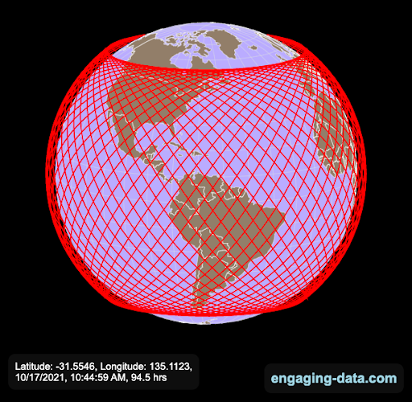
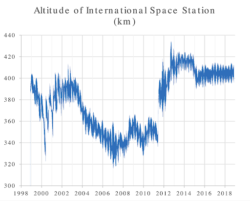
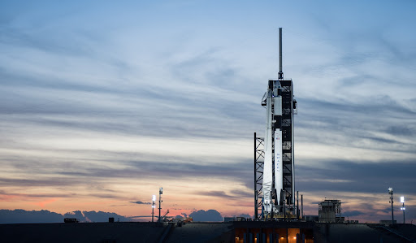
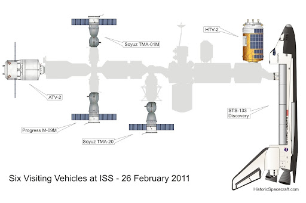
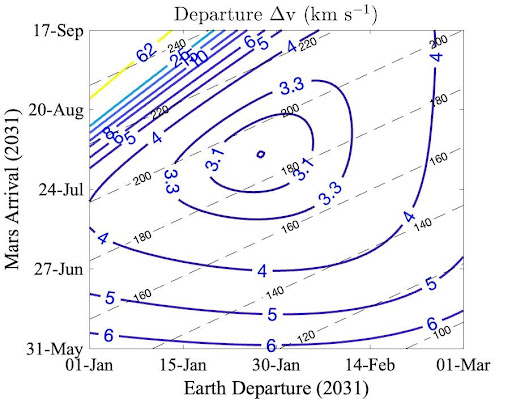
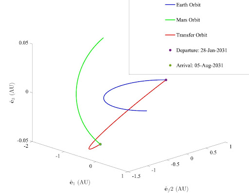
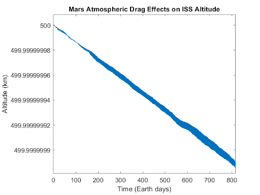

<i>NOTE: our report was written in Google Docs, and was converted to markdown using https://workspace.google.com/marketplace/app/docs_to_markdown/700168918607. Some components did not translate smoothly.</i>

>>>>>  gd2md-html alert:  ERRORs: 0; WARNINGs: 2; ALERTS: 10.

<ul style="color: red; font-weight: bold"><li>See top comment block for details on ERRORs and WARNINGs. <li>In the converted Markdown or HTML, search for inline alerts that start with >>>>>  gd2md-html alert:  for specific instances that need correction.</ul>

Links to alert messages:
<a href="#gdcalert1">alert1</a>
<a href="#gdcalert2">alert2</a>
<a href="#gdcalert3">alert3</a>
<a href="#gdcalert4">alert4</a>
<a href="#gdcalert5">alert5</a>
<a href="#gdcalert6">alert6</a>
<a href="#gdcalert7">alert7</a>
<a href="#gdcalert8">alert8</a>
<a href="#gdcalert9">alert9</a>
<a href="#gdcalert10">alert10</a>

>>>>> PLEASE check and correct alert issues and delete this message and the inline alerts.

Proposal to Transfer the ISS to Mars by 2032

Derek Goss, Brady Sites, Caden DeWitz

_MAE 4060 Introduction to Spaceflight Mechanics, FA21_

_Sibley School of Mechanical and Aerospace Engineering_

_Cornell University, Ithaca, NY 14853_

_7 December 2021_

# 1. Mission Concept Statement

We propose a series of two crewed missions and one uncrewed mission beginning in 2028 to renovate and transfer critical modules from the ISS to a stable orbit in low-Mars atmosphere in 2031. This new Martian space station will serve as a “Gateway” hub to support future crewed missions to the planet’s surface for at least one decade.

# 2. Mission Justification

The ISS has been used for decades as a testing ground for long-term space survival and repeated surface to low-planetary orbit missions. [1] The ISS also has an extensive list of scientific equipment: including microscopes, incubators, centrifuges, dosimetry equipment, acceleration measurement systems, and freezers, all of which could be helpful to have available as resources for future Mars missions. [2] Having all of this proven technology available for Mars exploration would decrease new variables in future crewed missions. 

The NASA Gateway, an upcoming space station to be placed in lunar orbit, will be a critical component of the Artemis mission to establish a long-term human presence on the Moon. [3] If humans are to explore Mars, it is inevitable that a Gateway-like Martian space station will be equally necessary to facilitate these deep space missions. [4] Additionally, ambitious NASA plans for Martian colonies will benefit from the capability to shuttle crews to the surface of Mars and back using a reusable vehicle. [5]

The ISS has funding to operate through 2024, and is technically cleared to continue operation through 2028. According to a statement from the NASA inspector general, “the ISS platform has significant structural life well beyond 2028 and many of its modules, particularly those launched in the latter years of ISS assembly, are likely to have structural life well into the 2030s.” [6]

Our timeline is based on this 2028 clearance rating from Boeing. A three year renovation period will commence in 2028, with transfer operations to Mars occurring in 2031 — leading to final station readiness in 2032.

# 3. Upgrades & Repairs

Before beginning an orbital transfer, the ISS needs to be prepared to last in low Mars orbit. Most of the modules will be about two decades old by the time it reaches its destination, and will have been outpaced technologically, not to mention regular system failures that are handled on a regular basis. [10] Additionally, the ISS is designed_ _for LEO and isn’t necessarily guaranteed to fare well in orbit around another planet. However, the Martian atmosphere is significantly less dense than Earth’s, which means that the ISS won’t need as much thrusting to combat atmospheric drag. Thus, maintaining an orbit around Mars is well within the capabilities of the ISS.

Our upgraded ISS does not require most of the modules currently attached, as most of the modules currently installed are for scientific purposes that are extraneous to our objective. [2] [10] Ultimately, we intend to conduct two crewed missions in order to make repairs, upgrades, and strip the ISS of nonessential modules. Nonessential modules will be deorbited.

The goal of the first crewed mission in 2028 is to disassemble and deorbit modules of the ISS noncritical to the mission, and inspect the remaining modules to discover any needed upgrades or repairs. The goal of the second crewed mission in 2030 is to install new hardware and perform final renovations.

As of now, the total mass of the ISS in just modules is 417,289 kg, with mass unaccounted for coming from crew, food, propellants, and other items. As a part of our upgrades and repairs, we plan to strip the ISS of all non-critical modules, and this would reduce the mass of the ISS by a factor of about 3. For reference, the ISS was 137,665 kg in 2001 after the Russian Docking Compartment DC-1 was installed [10]. This yields a ballpark final ISS mass estimate of 150,000 kg.

Unless significant amounts of new hardware are required, we expect the amount of mass needed to be launched into LEO to be on the order of the total mass of 2 critical ISS modules. For reference, the critical Zvezda Service Module weighed 22,776 kg at launch. [35] One Falcon Heavy launch can accommodate approximately 2.8 of these modules, meaning our renovations should be able to be transferred in one launch.

# 4. ISS Rendezvous

Knowing the exact location of the ISS will be critical at two times: once during the launch to upgrade and repair the station, and again when the station is ready to begin its orbital transfer to Mars. The orbit of the ISS is approximately circular with a nominal altitude of 409 km and an inclination of 51.6°, with an orbital period of 90–93 minutes. The orbital ground tracks over the Earth approximately repeat every 3 days.

>>>>>  gd2md-html alert: inline image link here (to images/image1.png). Store image on your image server and adjust path/filename/extension if necessary.  (<a href="#">Back to top</a>)(<a href="#gdcalert2">Next alert</a>) >>>>> 

_Figure 1. _ISS orbit visualization. The ground tracks repeat every 3 days. Figure source: [23]

Due to atmospheric drag, the ISS altitude decreases over time and requires periodic thrusting to re-adjust to a nominal level. Consequently, knowing the precise position of the ISS requires an understanding of the exact altitude of the station at a given point in time, which varies depending on how frequently the station is boosted into a higher orbit. [17]

>>>>>  gd2md-html alert: inline image link here (to images/image2.png). Store image on your image server and adjust path/filename/extension if necessary.  (<a href="#">Back to top</a>)(<a href="#gdcalert3">Next alert</a>) >>>>> 

_Figure 2._ ISS altitude variation. Reduction in altitude from atmospheric drag requires periodic thrusts to re-adjust the ISS altitude to a nominal level. Figure source: [22]

Given this knowledge in the future near the mission time, we can calculate the orbital parameters with the following method. At one point during its orbit on October 28 2021, JPL Horizons says that the ISS had the state vector of:

r = [5.662280262612702E+03, -1.030749255416963E+03,  3.613354541469185E+03]; %km

v = [4.244537156801433E+00,  1.592926680468770E+00, -6.176823046016166E+00]; %km/s

mue = 3.986E5; %km^3/s^2

The central body here is the Earth and the coordinate frame is geocentric. Inputting these variables into our calculator for orbital elements from Week 4 homework, we can get the following orbital elements:

semi-major axis = 6.8015e+03 %km

eccentricity = 0.0016

eccentric anomaly = 1.0139

inclination = 1.3106

argument of periapsis = 1.5436

longitude of the ascending node = 3.1295

time of periapsis passage = 4.6828e+03 %s

JPL Horizons can also provide the osculating orbital parameters directly.

Typically, launches to the ISS have taken place from LC-39A at Kennedy Space Center. This low-latitude launch location reduces the amount of delta-V required to rendezvous with the ISS due to the rotation of the Earth. In terms of launch vehicles, either the SpaceX Falcon 9 or Falcon Heavy will be natural choices given their proven capability for both crewed and uncrewed missions in addition to the extensive existing infrastructure built for their operation at LC-39A. Given that the Space Shuttle was capable of transporting 27,500 kg of payload to low Earth orbit (LEO), the Falcon 9 is slightly less capable at a rated payload of 22,800 kg to LEO while the Falcon Heavy can transfer far more at up to 63,800 kg to LEO. [18] [19] Although the exact delta-V required to rendezvous with the ISS is dependent on specific characteristics of the launch vehicle due to gravity losses, NASA estimates that it takes about 9.4 km/s of delta-V to reach LEO. [20]

>>>>>  gd2md-html alert: inline image link here (to images/image3.jpg). Store image on your image server and adjust path/filename/extension if necessary.  (<a href="#">Back to top</a>)(<a href="#gdcalert4">Next alert</a>) >>>>> 

_Figure 3. _Falcon 9 at LC39-A. Figure source: [24]

The ISS has up to 8 docking ports, enabling multiple spacecraft to rendezvous to support renovation activities while in LEO. [21]

>>>>>  gd2md-html alert: inline image link here (to images/image4.jpg). Store image on your image server and adjust path/filename/extension if necessary.  (<a href="#">Back to top</a>)(<a href="#gdcalert5">Next alert</a>) >>>>> 

_Figure 4. _“Six Visiting Vehicles at ISS”. The ISS has up to 8 docking ports. Figure source: [25]

# 

# 5. Orbital Transfer

The transfer would follow the basic steps of a Hohmann Transfer orbit, using two controlled accelerations on the ISS. The goal is to reduce the needed impulses and therefore the required fuel, and the Hohmann transfer would be the most efficient for the Earth-Mars transfer due to their relatively similar semi-major axes. [7] The first burn would transition the ISS to a new, highly elliptical solar orbit, with the Sun-Earth radius acting as periapsis and the Sun-Mars radius acting as apoapsis. This initial acceleration would be along the trajectory of the Earth. The second burn would be to insert into the Sun-Mars orbital path. The opportunity to make this transfer so that the ISS would be inserted into the Sun-Mars orbit at a time where Mars is at the end of the trajectory comes around roughly every 25 months. [8] The capture orbit would likely be highly elliptical, so further burns would be needed to bring the ISS into a relatively non-elliptical orbit around Mars. [9]

The Hohmann transfer assumes coplanar orbits and tangential burns, which cannot be assumed with the Earth-Mars transfer. However, it is useful as a first approximation. The geometry of the Hohmann Transfer requires the transfer to occur relatively near the date of Mars opposition, giving a reasonable range of dates to narrow the search range beyond the entire synodic period of Mars.

A more general estimate can be achieved by calculating the orbital positions and velocities of Earth and Mars, using known orbital parameters over a specified date range. [15] [16] This orbital data can then be used to solve Lambert’s Problem for every possible pair of departure and arrival dates within the date range, assuming negligible perturbations and instantaneous velocity changes. The NASA trajectory browser suggests minimum delta-V Earth-Mars transfers occurring during January-February in 2031, with a transfer time of approximately 150-200 days. [31] 

Solving Lambert’s Problem across this date range using these expected transfer times produces Figure 5 and Table 1, indicating the optimal transfer dates and minimum delta-V for the transfer orbit.

>>>>>  gd2md-html alert: inline image link here (to images/image5.jpg). Store image on your image server and adjust path/filename/extension if necessary.  (<a href="#">Back to top</a>)(<a href="#gdcalert6">Next alert</a>) >>>>> 

_Figure 5. _Earth-Mars transfer orbit porkchop plot. Solving Lambert’s problem for every set of departure and arrival dates generates the optimal departure and arrival dates for delta-v minimization: 28-Jan-2031 to 05-Aug-2031. The minimum delta-V is 2.9992 km/s. The date ranges were selected from the dates of the optimal 2031 Earth-Mars transfer trajectories predicted by NASA in source [31]

_Table 1. _Earth-Mars transfer-orbit dates and delta-V requirements for 2031 launch opportunity.

<table>
  <tr>
   <td>Departure Date
   </td>
   <td>

28-Jan-2031

   </td>
  </tr>
  <tr>
   <td>Arrival Date
   </td>
   <td>

05-Aug-2031

   </td>
  </tr>
  <tr>
   <td>Transfer Orbit Δv (km/s)
   </td>
   <td>

2.9992

   </td>
  </tr>
</table>

Using the transfer velocity and the starting position, orbital elements can be calculated for the transfer-orbit. The orbital elements are presented in Table 2.

_Table 2. _Earth-Mars transfer orbital elements for optimal 2031 launch opportunity.

<table>
  <tr>
   <td>Semi-Major Axis (AU)
   </td>
   <td>a
   </td>
   <td>

1.2377

   </td>
  </tr>
  <tr>
   <td>Eccentricity
   </td>
   <td>e
   </td>
   <td>

0.2056

   </td>
  </tr>
  <tr>
   <td>Eccentric Anomaly (rad)
   </td>
   <td>E
   </td>
   <td>

0.1027

   </td>
  </tr>
  <tr>
   <td>Inclination (rad)
   </td>
   <td>I
   </td>
   <td>

0.0389

   </td>
  </tr>
  <tr>
   <td>Argument of Periapsis (rad)
   </td>
   <td>ω
   </td>
   <td>

3.0163

   </td>
  </tr>
  <tr>
   <td>Longitude of Ascending Node (rad)
   </td>
   <td>Ω
   </td>
   <td>

5.3644

   </td>
  </tr>
  <tr>
   <td>Time of Periapsis (days)
   </td>
   <td>Tp
   </td>
   <td>

496.4071

   </td>
  </tr>
</table>

These orbital elements can be used to calculate the mean motion, mean anomaly, eccentric anomaly, and true anomaly of the ISS across the transfer time in order to plot its position. The positions of Earth and Mars can also be plotted using their known orbital elements at the transfer time. Figure 6 presents the positions of the Earth (blue), Mars (green), and ISS (red) in the heliocentric ecliptic frame during the Earth-Mars transfer. Figure 6 clearly illustrates a successful interception of Mars at the end of the transfer orbit.

>>>>>  gd2md-html alert: inline image link here (to images/image6.jpg). Store image on your image server and adjust path/filename/extension if necessary.  (<a href="#">Back to top</a>)(<a href="#gdcalert7">Next alert</a>) >>>>> 

_Figure 6._ The orbits of Earth (blue), Mars (green), and the ISS (red) are plotted in the heliocentric ecliptic frame during the orbital transfer.

# 6. Mars Orbit

The new orbit around Mars would be relatively low in altitude, at 500 km or less [4], to accommodate its use as a hub for surface missions. A balance must be struck between a low orbit to allow for less fuel on surface missions, and a slightly higher orbit that would require less refueling of the station in the long term. [13] However, with an atmospheric density less than 1% that of Earth, atmospheric drag around Mars will be less of a concern than the current Earth orbit. As shown in Figure 7, secular drag analysis based on a Glenn Research Center model of the Mars atmosphere shows effectively zero change in altitude over 10,000 orbital periods (based on the orbit about to be described). [32] [33]

>>>>>  gd2md-html alert: inline image link here (to images/image7.png). Store image on your image server and adjust path/filename/extension if necessary.  (<a href="#">Back to top</a>)(<a href="#gdcalert8">Next alert</a>) >>>>> 

_Figure 7._ Integrating the secular drag force over 10,000 periods shows a negligible decrease in Altitude. ISS ballistic coefficient and Mars atmosphere model derived from sources [32] [33]

We originally thought the mission would benefit from an areosynchronous orbit that simultaneously provides a constant communications resource for surface exploration [14] and a consistent re-docking point for returning surface vehicles, but this would require the ISS to orbit at a much higher altitude than we can accommodate in ground missions (tens of thousands of kilometers in altitude!). Therefore, we must focus our goal on making the ISS into a hub for ground missions.

As far as eccentricity goes, we would benefit most from a circular orbit. As well, in order to facilitate ground missions, we would like for the ISS to observe the same points of the surface at the same (local) time of day. That way, trajectory design for ground missions does not need to account for drastic variations in altitude over time, and the spacecraft can be accessed from a ground station each period.

This implies a simple sun-synchronous orbit, and in order to achieve this, nodal regression of the spacecraft needs to match the mean motion of the sun. After performing J2 perturbation analysis and calculating the solar mean motion, we find a similar result for a sun-synchronous LMO as we would expect for an LEO. The inclination needs to be near polar, precisely 93.3°. The final two orbital parameters are not necessarily relevant, as a circular orbit is symmetric in any rotation about its third axis, so we will set them to 0°. The Keplerian orbital elements for this orbit are summarized in Table 3.

_Table 3._ Orbital elements of the final ISS orbit around Mars.

<table>
  <tr>
   <td>Semi-Major Axis (km)
   </td>
   <td>a
   </td>
   <td>

3,914.5

   </td>
  </tr>
  <tr>
   <td>Eccentricity
   </td>
   <td>e
   </td>
   <td>

0

   </td>
  </tr>
  <tr>
   <td>Inclination (rad)
   </td>
   <td>I
   </td>
   <td>

1.62779

   </td>
  </tr>
  <tr>
   <td>Argument of Periapsis (rad)
   </td>
   <td>ω
   </td>
   <td>

0

   </td>
  </tr>
  <tr>
   <td>Longitude of Ascending Node (rad)
   </td>
   <td>Ω
   </td>
   <td>

0

   </td>
  </tr>
</table>

Now that the final Mars orbit is known, we can calculate the delta-V required to enter the intended Mars orbit from the Earth-Mars transfer orbit:

>>>>>  gd2md-html alert: equation: use MathJax/LaTeX if your publishing platform supports it.  (<a href="#">Back to top</a>)(<a href="#gdcalert9">Next alert</a>) >>>>> 

where      

>>>>>  gd2md-html alert: equation: use MathJax/LaTeX if your publishing platform supports it.  (<a href="#">Back to top</a>)(<a href="#gdcalert10">Next alert</a>) >>>>> 

and      

>>>>>  gd2md-html alert: equation: use MathJax/LaTeX if your publishing platform supports it.  (<a href="#">Back to top</a>)(<a href="#gdcalert11">Next alert</a>) >>>>> 

This produces a Mars injection Δv of 6.1197 km/s, which can be added to the previously calculated transfer orbit Δv to produce the total mission Δv in Table 4.

_Table 4._ Total mission Δv budget.

<table>
  <tr>
   <td>Transfer Orbit Δv (km/s)
   </td>
   <td>

2.9992

   </td>
  </tr>
  <tr>
   <td>Mars Injection Δv (km/s)
   </td>
   <td>

6.1197

   </td>
  </tr>
  <tr>
   <td><strong>Total Mission Δv (km/s)</strong>
   </td>
   <td>

<strong>9.1189</strong>

   </td>
  </tr>
</table>

# 7. Propulsion

The ISS was not designed to generate propulsion for an orbit transfer. The propulsion system in place merely provides reboosting and attitude control. [10] For example, the Zvezda Service module, one of the most essential components of the craft, consists of 32 small engines designed specifically for attitude control, which cannot provide the necessary thrust to enter Mars orbit. [10] [11]

Accordingly, we intend to equip the ISS with a more robust and efficient propulsion module. In the interest of reducing the amount of fuel capacity that would need to be added, we intend to install a gridded ion thruster EP system that can generate enough force to transfer all of the critical modules in one piece. Electrostatic propulsion is significantly more fuel efficient than chemical propulsion, producing much higher specific impulses, albeit with less thrust. Since the ISS is already in LEO, atmospheric drag will not significantly detract from the generated thrust. [12] Although ion thrusters have a relatively low power output, this could allow us to boost the ISS all the way to Mars without jerking the craft hard enough to compromise any of its more delicate structures. [12] This system will be delivered and installed during the second crewed upgrade mission prior to orbital transfer.

The most advanced gridded ion thruster currently in use is the QinetiQ T6 ion thruster. The BepiColombo spacecraft now orbiting Mercury uses four of these as its primary propulsion system, as they are light and highly efficient. One T6 thruster weighs 8.3 kg, and can produce up to 230 mN of thrust with a specific impulse of 4323 s. For reference, one T6 thruster could theoretically do the first burn of our mission with just 11.8 kg of gaseous Xenon fuel. However, the timescale of burning with such low thrust for an interplanetary mission would be nearly intractable, so a large array of thrusters would need to be operated in parallel. We estimate that a gridded ion EP system would need a total 75.24 kg of Xe fuel given our mission’s delta-V requirement.

The kind of power that NASA projects as necessary for one of these advanced propulsion systems for a Mars mission is, on the low end, 400kW. [26] With its current capabilities, the ISS can generate a total 215 kW of power from the solar array. [27] One T6 thruster requires 4.6 kW of power, allowing us to theoretically_ _operate 46 thrusters at once. Although additional analysis would be necessary to determine the tractability of such a design, it could generate an effective thrust of 10.58 N. At this level of thrust, power generation is not as concerning as our orbit, which was designed assuming we could produce instantaneous burns — reality is far from that. In fact, electrostatic thrusters are designed to be durable precisely because they need to burn for very long periods. To improve the integrity of our orbit, we should perform perturbatory analyses that account for finite burn lengths. [34]

Furthermore, since available solar intensity reduces as a function of distance from the sun squared, analysis will be required to determine how effective solar panels will be at producing the required energy for thrusting throughout the transfer and injection maneuvers. One option to mitigate power generation loss is to install a series of energy dense battery modules that operate in a bursted series of charging through solar and discharging through the thrusters. If significant amounts of energy are required, a nuclear power generation module similar to those used in submarines could be fitted as an addition to the space station. Nuclear would have an added benefit of very minimal refueling requirements (if any) and low fuel mass during a long term mission, however lightweight options for the full system are currently scarce. Batteries can quickly add up in mass as well.

Propulsion for the two crewed missions will be handled by the Merlin engines on the SpaceX Falcon rockets.

# 8. Orientation Requirements and Attitude Control

Communications equipment needs to be pointed towards the surface of Mars to enable spacecraft or personnel to reach the ISS as needed during surface operations. Additional communications equipment needs to point towards Earth at all times. Solar equipment needs to be directed towards the Sun through a combination of panel tilting and spacecraft orientation.

The ISS is already equipped with 32 attitude control engines rated at a force of 130.4 N, that are separated to cover all three axes of rotation. [29] The ISS also contains Control Momentum Gyroscopes for non propulsive control. [28] The ISS was explicitly designed to have control over its orientation. The ISS was even used to test the Zero Propellant Maneuver (ZPM) and it has been shown that the ISS is capable of both purposeful rotation between states and momentum desaturation without the use of fuel. [30] [28]

The ISS is equipped with a PD-based USTO control system that has been shown capable of correcting the ISS out of a tumble. [28] The manual control system was designed with minimal crew involvement, and the issue with turn-around time for a ground-assisted solution are mostly moot given the extended time frame of an orbital transfer.

It is reasonable to assume that the extant attitude control systems, properly examined and refueled during the upgrade and repair portion of the mission, would be sufficient for any pointing requirements needed to perform the orbital transfer, adjusting rotation in the final orbit with respect to Mars, as well as any emergency corrective measures that may be required.

# 9. Mission Timeline

A complete mission timeline is included in Table 5.

_Table 5._ Complete mission timeline for ISS transfer to Mars. *Asterisks indicate that additional analysis will be needed for the exact burn lengths depending on the thruster specifications.

<table>
  <tr>
   <td><strong>Event</strong>
   </td>
   <td><strong>Start Date</strong>
   </td>
   <td><strong>End Date</strong>
   </td>
  </tr>
  <tr>
   <td>Crewed Mission #1

Deorbiting unused modules, inspection.
   </td>
   <td>January 2028
   </td>
   <td>January 2028
   </td>
  </tr>
  <tr>
   <td>Renovation Planning and Parts Manufacturing
   </td>
   <td>January 2028
   </td>
   <td>October 2030
   </td>
  </tr>
  <tr>
   <td>Crewed Mission #2

Renovations and new module installations.
   </td>
   <td>November 2030
   </td>
   <td>November 2030
   </td>
  </tr>
  <tr>
   <td>System Checkouts
   </td>
   <td>November 2030
   </td>
   <td>January 2031
   </td>
  </tr>
  <tr>
   <td>Transfer Burn to Mars
   </td>
   <td>January 28, 2031
   </td>
   <td>January 2031*
   </td>
  </tr>
  <tr>
   <td>Mars Orbital Insertion Burn
   </td>
   <td>August 5, 2031
   </td>
   <td>August 2031*
   </td>
  </tr>
  <tr>
   <td>System Checkouts
   </td>
   <td>August 2031
   </td>
   <td>December 2031
   </td>
  </tr>
  <tr>
   <td>ISS Mars Service
   </td>
   <td>January 2032
   </td>
   <td>January 2042 

(subject to change)
   </td>
  </tr>
</table> 

# 10. References

[1] Dunbar, B. (2015, May 20). _What is the International Space Station?_ NASA. Retrieved October 8, 2021, from https://www.nasa.gov/audience/forstudents/k-4/stories/nasa-knows/what-is-the-iss-k4.html. 

[2] NASA. (2007, September 2). _Inventory of ISS Research Facilities and Capabilities Available to Support National laboratory Operations_. Retrieved October 8, 2021, from https://www.nasa.gov/pdf/181092main_10-Inventory%20Equipment%20list.pdf. 

[3] Mars, K. (2016, August 17). _Gateway_. NASA. Retrieved October 8, 2021, from https://www.nasa.gov/gateway/overview. 

[4] Gaffarel, J., Kadhum, A., Fazaeli, M., Apostolidis, D., Berger, M., Ciunaitis, L., Helsdingen, W., Landergren, L., Lentner, M., Neeser, J., Trotta, L., & Naeije, M. (2021, May 28). _From the martian surface to its low orbit in a reusable single-stage vehicle-charon_. MDPI. Retrieved October 8, 2021, from https://www.mdpi.com/2226-4310/8/6/153.

[5] NASA. (2015, October). _NASA's Journey to Mars_. Retrieved October 8, 2021, from https://www.nasa.gov/sites/default/files/atoms/files/journey-to-mars-next-steps-20151008_508.pdf. 

[6] Martin, P. K. (2019, July 10). _EXAMINING NASA’S PLANS FOR THE INTERNATIONAL SPACE STATION AND FUTURE ACTIVITIES IN LOW EARTH ORBIT_. Office of Inspector General. Retrieved October 8, 2021, from https://oig.nasa.gov/docs/CT-19-001.pdf. 

[7] NASA. _Basics of Spaceflight: Section 1: Environment, Chapter 4: Trajectories_. Retrieved October 8, 2021, from https://solarsystem.nasa.gov/basics/chapter4-1/.

[8] NASA. _Mars Orbit Insertion_. Retrieved October 8, 2021, from https://mars.nasa.gov/mro/mission/timeline/mtmoi/

[9] Braeunig, R. A. _Orbital Mechanics_. Retrieved October 8, 2021 from http://www.braeunig.us/space/orbmech.htm#maneuver

[10] Garcia, M. (2015, January 12). _International Space Station_ [Text]. NASA. http://www.nasa.gov/mission_pages/station/main/index.html.

[11] _Space Station User’s Guide | SpaceRef_. (n.d.). Retrieved October 8, 2021, from http://www.spaceref.com/iss/elements/sm.html.

[12] DeFelice, D. (n.d.). _NASA - Ion Propulsion: Farther, Faster, Cheaper_. Brian Dunbar. Retrieved October 8, 2021, from https://www.nasa.gov/centers/glenn/technology/Ion_Propulsion1.html.

[13] NASA. (2011, February 14). _Higher Altitude Improves Station's Fuel Economy_. Retrieved October 8, 2021, from https://www.nasa.gov/mission_pages/station/expeditions/expedition26/iss_altitude.html

 

[14] Montabone, L, and N Heavens. Observing Mars from Areostationary Orbit: Benefits and Applications. 

[https://mepag.jpl.nasa.gov/meeting/2020-04/whitetopics/WhitePaper_13_Montabone.Aerostationary.pdf](https://mepag.jpl.nasa.gov/meeting/2020-04/whitetopics/WhitePaper_13_Montabone.Aerostationary.pdf)

[15] NASA ( 25 November 2020) _Mars Fact Sheet._ Retrieved October 24, 2021, from [https://nssdc.gsfc.nasa.gov/planetary/factsheet/marsfact.html](https://nssdc.gsfc.nasa.gov/planetary/factsheet/marsfact.html)

[16] Willman, A. (2006 Apr 8) _Planet Mars Data._ Princeton. Retrieved October 25, 2021, from [https://nssdc.gsfc.nasa.gov/planetary/factsheet/marsfact.html](https://nssdc.gsfc.nasa.gov/planetary/factsheet/marsfact.html)

[17] NASA. (n.d.). _Space Station Orbit Tutorial_. Gateway to Astronaut Photography of Earth. Retrieved October 29, 2021, from https://eol.jsc.nasa.gov/Tools/orbitTutorial.htm. 

[18] SpaceX. (n.d.). _SpaceX Capabilities and Services_. Retrieved October 29, 2021, from https://www.spacex.com/media/Capabilities&Services.pdf. 

[19] Galvez, R. (n.d.). _The Space Shuttle and its Operations_. Retrieved October 29, 2021, from https://www.nasa.gov/centers/johnson/pdf/584722main_Wings-ch3a-pgs53-73.pdf. 

[20] _Low Earth Orbit_. National Aeronautics and Space Administration Wiki. (n.d.). Retrieved October 29, 2021, from https://nasa.fandom.com/wiki/Low_Earth_orbit. 

[21] NASA. (n.d.). _Main Elements of ISS_. Retrieved October 29, 2021, from https://www.nasa.gov/pdf/167120main_Elements.pdf. 

[22] _Altitude of International Space Station from 19 November 1998 to 22 November 2018_. Wikimedia Commons. (2018, October 23). Retrieved November 17, 2021, from [https://commons.wikimedia.org/wiki/File:Altitude_of_International_Space_Station.svg](https://commons.wikimedia.org/wiki/File:Altitude_of_International_Space_Station.svg).

[23] _Visualizing the orbit of the International Space Station (ISS)_. Engaging Data. (2021, October 13). Retrieved November 17, 2021, from https://engaging-data.com/orbit-international-space-station/. 

[24] Heiney, A. (2019, March 1). _Demo-1: SpaceX Falcon 9 is vertical at Launch Complex 39A_. NASA. Retrieved November 17, 2021, from [https://blogs.nasa.gov/commercialcrew/2019/03/01/demo-1-spacex-falcon-9-is-vertical-at-launch-complex-39a/](https://blogs.nasa.gov/commercialcrew/2019/03/01/demo-1-spacex-falcon-9-is-vertical-at-launch-complex-39a/).

[25] Kruse, R. (n.d.). _International Space Station Docking_. Historic Spacecraft. Retrieved November 17, 2021, from https://historicspacecraft.com/ISS.html. 

[26] Sands, K. (2020, October 16). The Propulsion We’re Supplying, It’s Electrifying [Text]. NASA. http://www.nasa.gov/feature/glenn/2020/the-propulsion-we-re-supplying-it-s-electrifying.

[27] Garcia, M. (2021, January 11). _New Solar Arrays to power NASA's International Space Station Research_. NASA. Retrieved November 17, 2021, from https://www.nasa.gov/feature/new-solar-arrays-to-power-nasa-s-international-space-station-research. 

[28] Bedrossian, N. et al. (2008, February 1-6) _ISS Contingency Attitude Control Recovery Method For Loss Of Automatic Thruster Control_. Retrieved December 1, 2021 from [https://ntrs.nasa.gov/api/citations/20080009592/downloads/20080009592.pdf](https://ntrs.nasa.gov/api/citations/20080009592/downloads/20080009592.pdf) 

[29] NASA. (n.d) _International Space Station Guide Systems_. Retrieved December 1, 2021 from [https://www.nasa.gov/pdf/167129main_Systems.pdf](https://www.nasa.gov/pdf/167129main_Systems.pdf) 

[30] Bedrossian, N. et al (2007, August 20-23) _First Ever Flight Demonstration of Zero Propellant Maneuver(TM) Attitude Control Concept_ AIAA 2007-6734. AIAA Guidance, Navigation and Control Conference and Exhibit.

[31] NASA. (n.d.). _2031 Earth-Mars Trajectory Browser_. NASA. Retrieved December 2, 2021, from https://trajbrowser.arc.nasa.gov/traj_browser.php?maxMag=25&maxOCC=4&chk_target_list=on&target_list=Mars&mission_class=oneway&mission_type=flyby&LD1=2031&LD2=2033&maxDT=300&DTunit=days&maxDV=4.0&min=DV&wdw_width=-1&submit=Search#a_load_results. 

[32] Nwankwo, V., & Chakrabarti, S. (2014). Theoretical Model of Drag Force Impact on a Model International Space Station Satellite due to Solar Activity. _TRANSACTIONS OF THE JAPAN SOCIETY FOR AERONAUTICAL AND SPACE SCIENCES SPACE TECHNOLOGY JAPAN_, _12_, 47–53.[ https://doi.org/10.2322/tastj.12.47](https://doi.org/10.2322/tastj.12.47)

[33] _Mars Atmosphere Model—Metric Units_. (n.d.). Retrieved December 3, 2021, from[ https://www.grc.nasa.gov/www/k-12/airplane/atmosmrm.html](https://www.grc.nasa.gov/www/k-12/airplane/atmosmrm.html)

[34] Fazio, N., Gabriel, S., Golosnoy, I., & Wollenhaupt, B. (2019, September 17). Mission Cost for Gridded Ion Engines using Alternative Propellants.

[35] _Zvezda Module_. (n.d.). Retrieved December 7, 2021, from http://www.khrunichev.ru/main.php?id=54.
